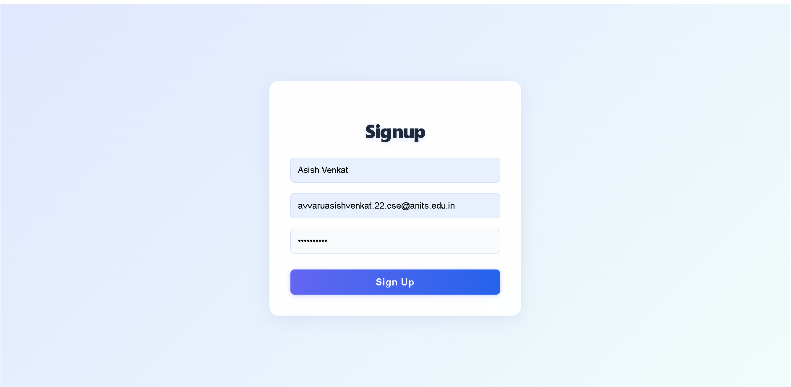
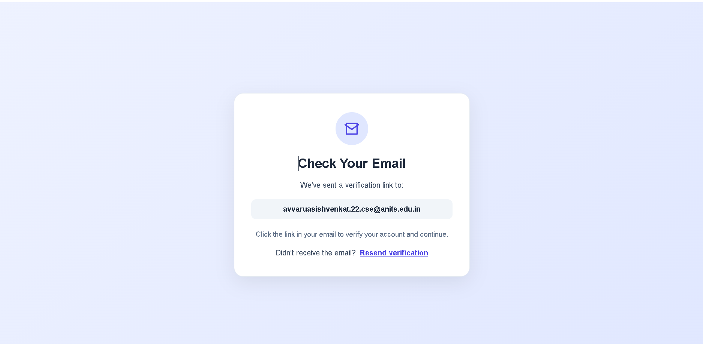
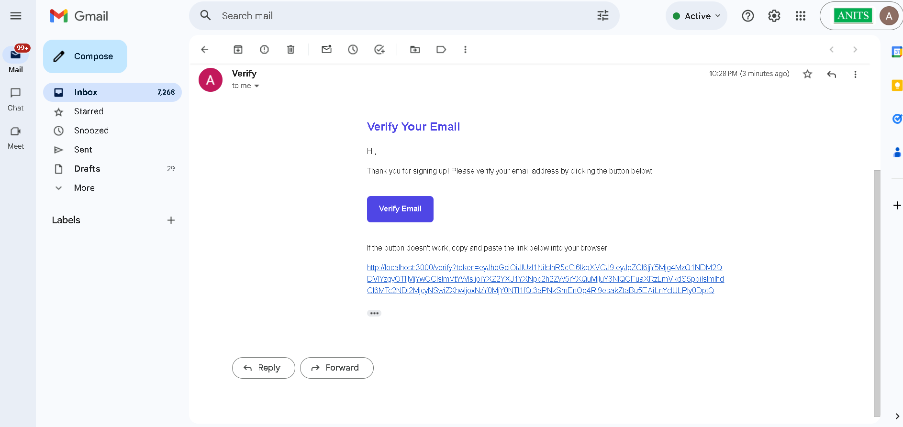
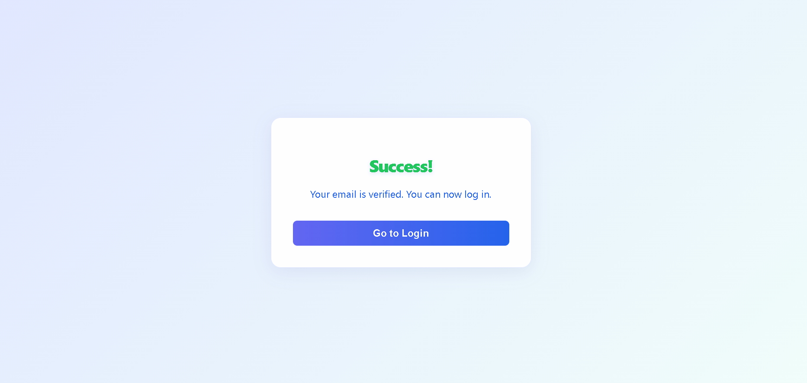

#  Email Verification Signup System

## Overview
A full-featured, production-grade signup and email verification system built with Node.js, Express, MongoDB Atlas, JWT, and React. Includes secure authentication, modern UI, and Docker support.

---


## Deployed URLs

- **Frontend:** [https://email-verification-feature.vercel.app](https://email-verification-feature.vercel.app)
- **Backend API (Docker on Render):** [https://email-verification-backend-d7to.onrender.com](https://email-verification-backend-d7to.onrender.com)

---

## Architectural Flow
```
+---------------------+          +-----------------------+
|     User Browser    | <------> |   Frontend (Vercel)   |
|   (React + Vite)    |          | Loads UI & Sends APIs |
+----------+----------+          +-----------+-----------+
           |                                 |
           |     API Calls (Signup / Resend / Verify) 
           |                                 |
           v                                 |
+----------+----------+                      |
|      Backend        |                      |
| (Render, Express)   | ---------------------+
|   Dockerized API    |   1. Send Email (HTTPS)
+----------+----------+                      |
           |                                 v
           |                      +-----------+-----------+
           |                      |      Mailjet          |
           |                      |   (Email Delivery)    |
           |                      +-----------+-----------+
           |                                  |
           |          2. Email Delivered       v
           |                      +-----------------------+
           |                      |   User Email Inbox    |
           |                      | (Gmail / Outlook etc) |
           |                      +-----------+-----------+
           |                                  |
           |      3. User clicks verification |
           |         https://frontend/verify?token=XYZ
           |                                  |
           |                                  v
           |                      +-----------------------+
           |                      |   Frontend (Vercel)   |
           |                      |  Loads Verify Page    |
           |                      +-----------+-----------+
           |                                  |
           |      4. Frontend → Backend: /api/verify?token
           |                                  |
           v                                  v
+----------+----------+          +-----------+-----------+
|   MongoDB Atlas     | <------- |      Backend         |
| (User Storage:      |   5.     |  Verifies Token,     |
| users, tokens)      | Updates  | Updates User Status  |
+---------------------+  User    +-----------------------+
```
### FINAL RESULT:
Backend responds → Frontend shows "Success" or "Token expired"


##  Setup & Run Instructions

### 1. Clone the repository
```sh
git clone <your-repo-url>
cd Trizen-2
```

### 2. Backend Setup
```sh
cd backend
npm install
# Create a .env file with your MongoDB, JWT, SMTP credentials
npm start
```

### 3. Frontend Setup
```sh
cd ../frontend
npm install
npm run dev
```

### 4. Docker (Backend)
```sh
cd backend
docker build -t asishvenkat/trizen-backend:latest .
docker run -p 5000:5000 --env-file .env asishvenkat/trizen-backend:latest
```

---


# Demo Video

Watch the project demo here: [Google Drive Video](https://drive.google.com/file/d/1myqflOTQRFFG4_zf4LOjNHU3U3_IinrX/view?usp=sharing)

# Project Images

Below are the images present in the `public` folder, shown in the same order (1, 2, 3, 4):

<div align="center" style="display: flex; justify-content: center; gap: 20px;">
  
  
</div>

<br/>

<div align="center" style="display: flex; justify-content: center; gap: 20px;">
  
  
</div>


##  Design Choices
- **JWT for verification tokens:** Secure, expirable, and stateless.
- **MongoDB Atlas:** Scalable, cloud-based database.
- **Nodemailer:** For sending transactional emails.
- **React + Vite:** Fast, modern frontend with professional UI.
- **Docker:** Easy deployment and environment consistency.
- **Password validation:** Enforced on both frontend and backend.
- **Rate limiting:** Prevents abuse of resend functionality.
- **Clear user flow:** Modern UX with clear feedback and error handling.

---

##  Libraries & Services Used
- **Backend:**
	- express
	- mongoose
	- jsonwebtoken
	- bcryptjs
	- nodemailer
	- dotenv
- **Frontend:**
	- react
	- react-router-dom
	- axios
	- vite
- **Other:**
	- MongoDB Atlas
	- Docker

---

## Security & Scalability
- Tokens are signed, expirable, and non-reusable
- HTTPS enforced in email links
- Rate limiting for resends
- Scalable DB and stateless token design
  
##  Credits
Developed by asishvenkat

##  Credits
Developed by **Asish Venkat**

---

Thank you for reviewing this project!


